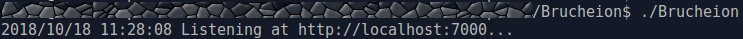
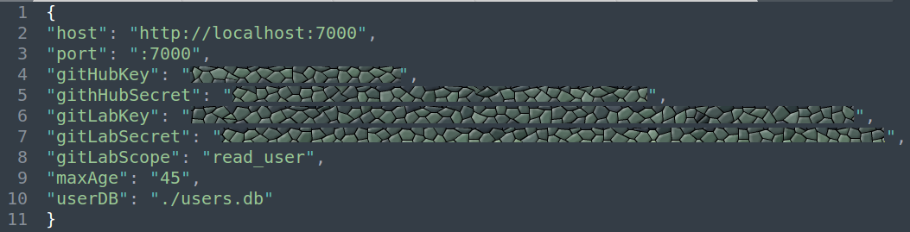
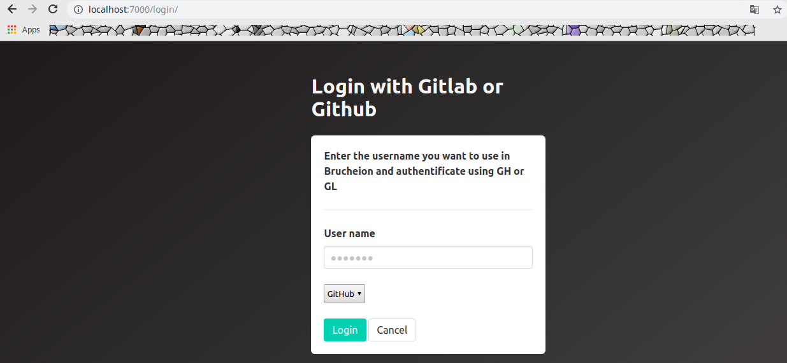
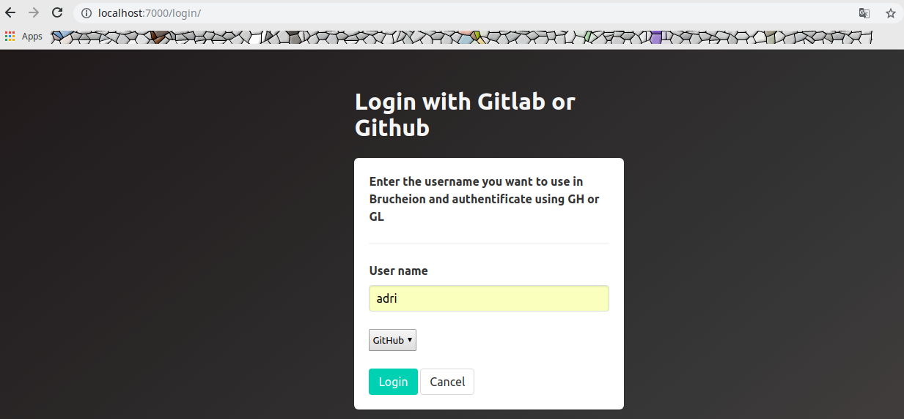
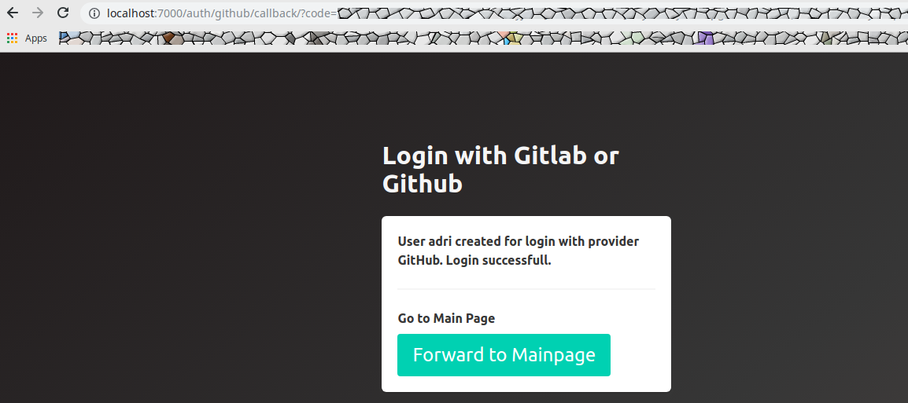
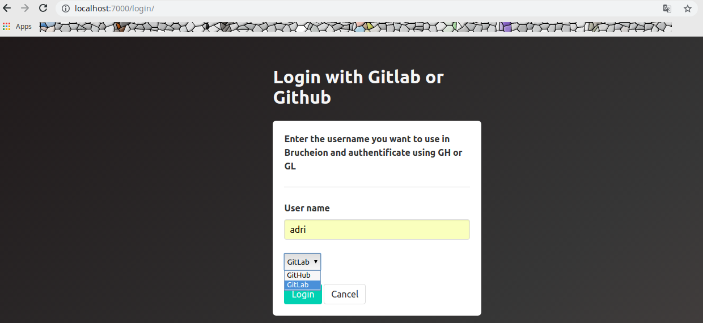
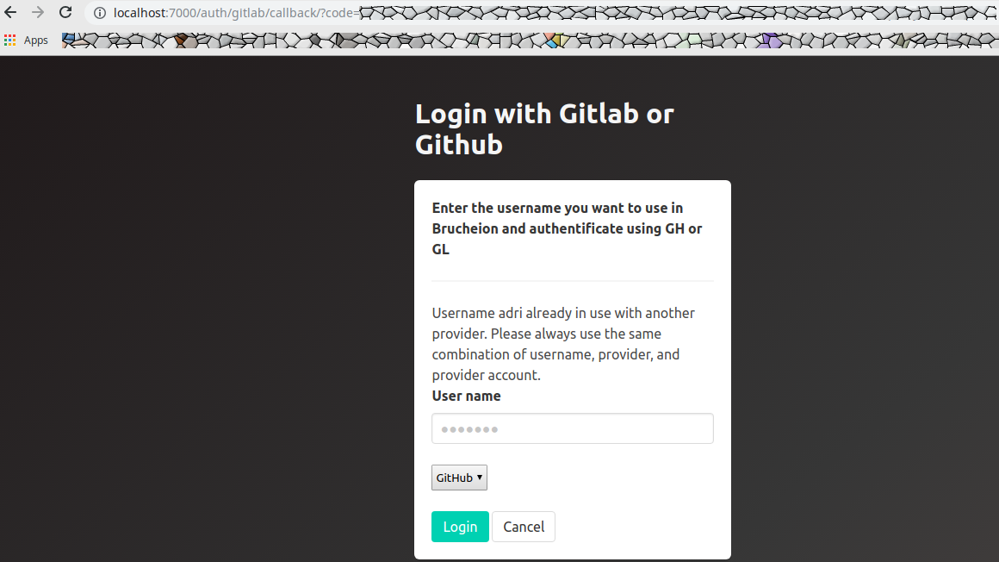
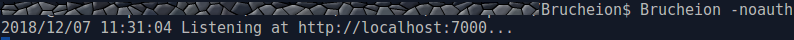

Brucheion is a Virtual Research Environment (VRE) to create Linked Open Data (LOD) for historical languages and the research of historical objects.

## Using Brucheion

Parts of Brucheion are ready to be tested. Please note, that the VRE is still under development and potentially buggy.

## Install 

To install Brucheion simply obtain an official release from your Brucheion distribution channels. The release will contain a binary file that will likely run on your operating system. If your operating system isn't supported you will need to compile it on your machine. Compiling on linux for a 64 bit linux the Terminal you may use: `env GOOS=linux GOARCH=amd64 make build`. See this overview explanation of [How To Build Go Executables for Multiple Platforms](https://www.digitalocean.com/community/tutorials/how-to-build-go-executables-for-multiple-platforms-on-ubuntu-16-04).


## Usage

If you simply want to try out Brucheion with the standard configuration you can start it using the terminal:



As soon as Brucheion is running you may access it using your favorite browser. 

### Configuration

Brucheion is configured using a file called the config.json. 



JSON is a common data format used for asynchronous browser–server communication, that uses human-readable text to transmit data objects consisting of attribute–value pairs and array data types.<sup id="1">[1](#Wikipedia_JSON)</sup> Therefore it is essential to format config.json correctly.

```JSON
{
"host": "http://localhost:7000",
"port": ":7000",
"gitHubKey": "20bitkey",
"githHubSecret": "40bitsecret",
"gitLabKey": "64bitkey",
"gitLabSecret": "64bitsecret",
"gitLabScope": "read_user",
"maxAge": "43200",
"userDB": "./users.db"
}

//"googleKey": "",
//"googleSecret": "",
```

* The file content starts with { and ends with }. 
* Comments can be added __outside__ of the parenthesis using two forward slashes //
* Every entry name needs to be written inside parenthesis "" followed by colon and the value in parenthesis.
* Every, but the last line need to be separated with a comma
* "host" defines the address your Brucheion server will use
* "port" the port needs to be redefined for some functions to work
* "gitHubKey" defines the application key received from GitHub. This should be a 20 bit key, called 'Client ID' in the OAuth application settings.
* "githHubSecret" defines the application secret received from GitHub. This should be a 40 bit key, called 'Client Secret' in the OAuth application settings.
* "gitLabSecret" defines the application key received from GitLab. This should be a 64 bit key, called 'Application ID' in the applications user settings.
* "gitLabSecret" defines the application secret received from GitLab. This should be a 64 bit key, called 'Secret' in the applications user settings.
* "gitLabScope": "read_user" is necessary to properly set up the login via GitLab. Just leave this line unaltered.
* "maxAge" defines the time to live for the Brucheion session and its respective cookie in seconds. It may be set to a value that seems fitting for your scenarios. (A specific amount of days can be set multiplying 86400 by the amount of days. So for one day the line would be `"maxAge": "86400 * 1",`)
* "userDB" defines the location where the user database will be saved. By default it will be saved in the same folder the Brucheion executable resides. If you don't have a user database yet, one will be created with the first execution of Brucheion.
* Google may be added as a login provider later.

### Login

Users can login with or without verification. It is recommended to login with verification using a login provider. 

#### The ordinary login process using a login provider

For logging in with a provider start Brucheion normally (without the noauth flag). Brucheion supports authentification with GitHub and GitLab. Accordingly, the user needs a GitHub or a GitLab account. 

1. When the server is running navigate to /login/ (with the standard configuration navigate to http://localhost:7000/login/)



2. Enter a user name of your liking. For this tutorial it'll be Adri.



3. Choose the login provider that you want to use to authenticate and click on login. If the user is new you should see the following confirmation message:



4. To choose another provider simply use the drop-down menu:



5. You can only use the same user name with the same login provider. For example: if user Adri tries to login using his GitLab account, Brucheion will show an error message:



6. Likewise, a new user can not be registered with a GitHub or GitLab account that is already in use.

#### The login process without a login provider

For logging in without authentification start Brucheion with setting the noauth flag. 



## Development

For development or building Brucheion, you will need the following software: [Go](https://golang.org/) (`>= 1.14`) and [Node.js](https://nodejs.org/) (`>= v12`). Furthermore, you will need to obtain a fork of the [`pkger`](https://github.com/markbates/pkger) tool (`go get https://github.com/falafeljan/pkger`).

The following workflow has been tested on macOS but should work on any Unix-based machine. By using `make`, you can issue the following commands:

* `make` Create a production build of Brucheion. Install all dependencies, run all tests, build the UI and compile Brucheion.
* `make test` Run all tests.
* `make build` Build the UI and compile Brucheion.
* `make dev` Continuously build the UI as files are changed. Use it in conjunction of the `-localAssets` flag of Brucheion to load changing JavaScript bundles on the fly during runtime.
* `make deps` Install all Node.js dependencies.
* `make clean` Remove all generated files. If any undocumented errors occur during development or compilation, try this command and reinstall all dependencies via `make deps`.

Running `make` should sufficiently prepare your machine for development. More recent components of the Brucheion UI are build as an interactive JavaScript application using the [Svelte](https://svelte.dev/) framework. Parts related to this UI are situated in the `ui` folder.

In order to develop the Svelte-based UI, start a development process via `make dev`; it will reprocess all JavaScript files as they are being changed. Then, run the Brucheion binary via `./Brucheion` and access Brucheion via `https://localhost:7000/` in your browser. After changing parts of the UI JavaScript code, simply refresh the website.

### References

<b id="Wikipedia_JSON">1</b> https://en.wikipedia.org/wiki/JSON [↩](#1)


