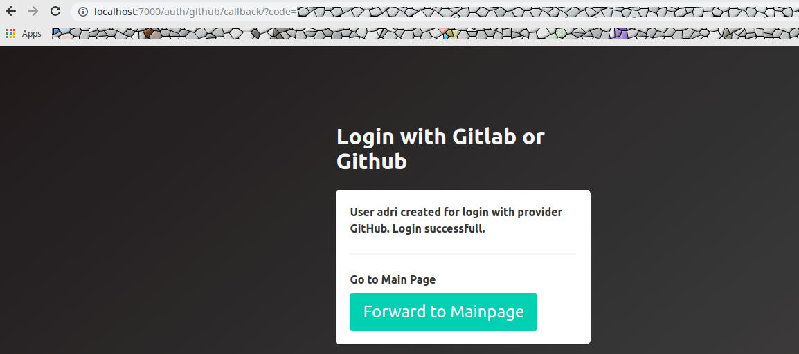
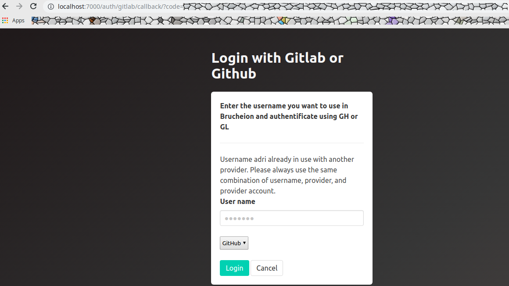

# Usage

If you simply want to try out Brucheion with the standard configuration you can start it using the terminal:

As soon as Brucheion is running, you may access it using your favorite browser on the URL given in the terminal output. 

## Login

Users can sign in with or without verification. It is recommended to login with verification using a login provider such as GitHub. 

### Login Process Using a Login Provider

For logging in with a provider start Brucheion normally (i.e., `./Brucheion` **without** the `-noauth` flag). Brucheion supports authentication with GitHub and GitLab. Accordingly, the user needs a GitHub or a GitLab account. 

1. When the server is running navigate to `/login/` (with the standard configuration, navigate to http://localhost:7000/login/)

    

2. Enter a user name of your liking. For this tutorial it'll be Adri.

    

3. Choose the login provider that you want to authenticate with and click on _Login_. If the user is new you should see the following confirmation message:

    

4. To choose another provider simply use the drop-down menu:

    

5. You can only use the same user name with the same login provider. For example, if user Adri tries to login using his GitLab account, Brucheion will show an error message:

    

6. Likewise, a new user can't be registered with a GitHub or GitLab account that is already in use.

### Login Process Without a Login Provider

For logging in without authentication start Brucheion with setting the `-noauth` flag. 

